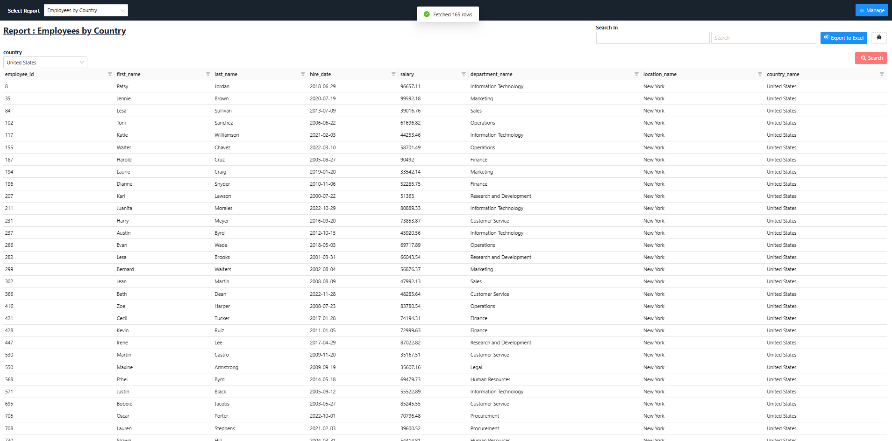
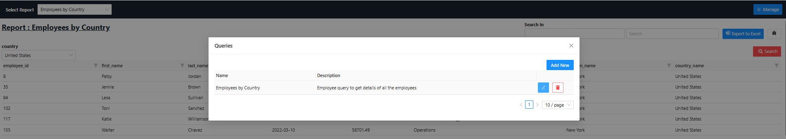
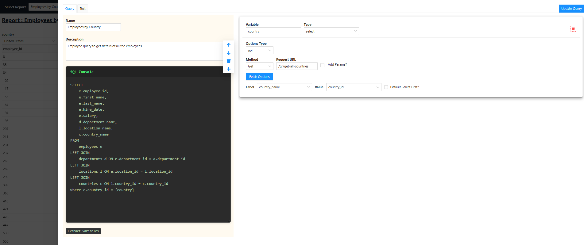
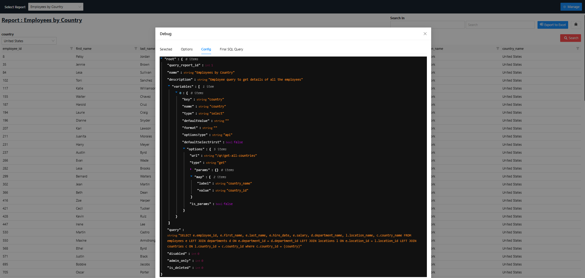
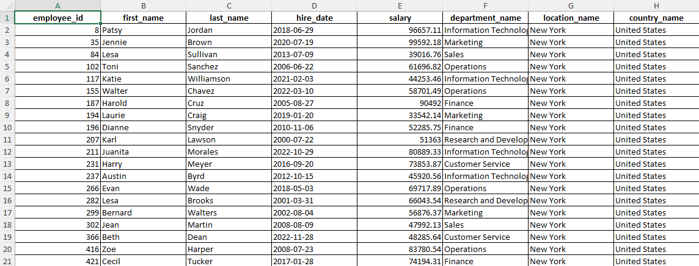

# query-reports

Query Reports is a customizable web application for running direct database queries with dynamic, user-configurable variables. It provides a user-friendly interface to create, manage, and execute SQL queries, and export results to Excel with advanced filtering capabilities.

---

## Features

- **Custom Query Menu:** Organize and select from a list of saved SQL queries.
- **Dynamic Variables:** Define variables in your SQL using `{variable}` syntax. These are automatically extracted and rendered as configurable form fields.
- **Variable Types:**
  - `input`: Text input
  - `input-number`: Numeric input
  - `hardcoded`: Display-only value
  - `select`: Dropdown (API or hardcoded options)
  - `multi-select`: Multi-select dropdown
  - `date-time`: Date/time picker (with custom format, time, hour, minute, second options)
- **Configurable Options:**
  - For selects: options can be fetched from an API or hardcoded
  - API options support dynamic parameters mapped from other variables
- **Query Execution:**
  - Only `SELECT` queries are allowed (safe-guarded on backend)
  - Variables are replaced at runtime before execution
- **Result Table:**
  - Filter and search each column
  - Export results to Excel (with column/row formatting)
- **Add/Edit Queries:**
  - UI to add new queries, define variables, and configure their types/options
- **Backend:**
  - Built with FastAPI (Python)
  - MySQL database (see `server/table.sql` for schema)

---

## How It Works

1. **Define a Query:**
   - Use `{variable}` in your SQL to mark dynamic fields.
   - Example: `SELECT * FROM employees WHERE department_id = {dept} AND hire_date >= {from_date}`
2. **Configure Variables:**
   - Each `{variable}` can be configured with type, default, options, etc.
   - Supported types and options are described below.
3. **Run & Export:**
   - Fill in the form, run the query, and export results to Excel.

---

## Variable Configuration

Each query has a `variables` array in its config. Example:

```json
[
  {
    "type": "select",
    "name": "dept",
    "defaultValue": 1,
    "optionsType": "api",
    "defaultSelectFirst": true,
    "options": {
      "url": "/api/departments",
      "type": "get",
      "params": {},
      "map": { "label": "department_name", "value": "department_id" }
    }
  },
  {
    "type": "date-time",
    "name": "from_date",
    "format": "YYYY-MM-DD",
    "defaultValue": null,
    "showTime": false
  }
]
```

- See code comments in `QueryReports.js` for full variable config reference.

---

## Tech Stack

- **Frontend:** React, Ant Design, React Query
- **Backend:** FastAPI (Python), SQLAlchemy, MySQL
- **Export:** ExcelJS, FileSaver.js

---

## Setup & Installation

### Backend

1. Install Python dependencies:
   ```cmd
   pip install -r server/requirements.txt
   ```
2. Set up your `.env` in `server/` (see example in repo).
3. Create the database schema using `server/table.sql`.
4. Run the FastAPI server:
   ```cmd
   python server/main.py
   ```

### Frontend

1. Install Node dependencies:
   ```cmd
   cd client
   npm install
   ```
2. Start the React app:
   ```cmd
   npm start
   ```

---

## Usage

- Access the app in your browser (default: `http://localhost:3000/query-reports-demo`)
- Select or add a report, configure variables, and run queries.
- Export results to Excel. Each column supports filtering and search.

---

## Screenshots

Below are some screenshots demonstrating key features of Query Reports:

### 1. Query Execution



_Run a saved SQL query with dynamic variables. Fill in the form fields generated from your query's variables, then execute and view results instantly._

### 2. Query List



_Browse and manage all saved queries. Easily select, edit, or add new queries from the organized menu._

### 3. Query Configuration



_Configure a query's SQL, variables, and options. Define variable types, default values, and data sources for dropdowns._

### 4. Variable Form Fields



_Dynamic form fields are generated based on your query's variables, supporting various input types such as text, number, select, and date/time._

### 5. Export Results



_After running a query, filter and search results directly in the table. Export the filtered data to Excel with a single click._

---

## License

See [LICENSE](LICENSE).
